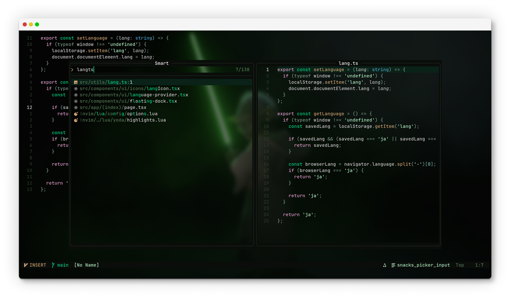

# Contributing to yoda.nvim 🌿

First off, thanks for taking the time to contribute! 🎉



> [!TIP]
> The best way you can contribute to yoda.nvim is by giving it a star ⭐️ and sharing it with others!

Every contribution is appreciated, whether it's a bug report, a feature request, a question, or a pull request. This document will guide you through the process of contributing to this project.

*May the Force be with your code.* ✨

## Table of Contents 📚

- [Reporting Bugs & Requesting Features](#reporting-bugs--requesting-features-)
- [Development Setup](#development-setup-)
- [Pull Requests](#pull-requests-)
- [Adding Support for Plugins](#adding-support-for-plugins-)
- [Testing & CI](#testing--ci-)
- [Code Style](#code-style-)

## Reporting Bugs & Requesting Features 🐛

If you find a bug or have a feature request, please open an issue with as much detail as possible:

Some things to keep in mind when opening an issue:

- Make sure to search for existing issues before opening a new one. If you find an existing issue that matches your problem, please add a 👍 reaction to it.
- Be as detailed as possible when describing the bug or feature request. Include any relevant information, such as the version of Neovim you're using & your yoda.nvim config settings.
- Include screenshots or theme previews when reporting visual issues.

## Development Setup 🛠️

1. **Fork and clone the repository**
   ```bash
   git clone https://github.com/YOUR_USERNAME/yoda.nvim.git
   cd yoda.nvim
   ```

2. **Set up local development** in your Neovim config:
   ```lua
   -- For development
   {
     dir = "~/path/to/yoda.nvim",
     lazy = false,
     priority = 1000,
     config = function()
       vim.cmd("colorscheme yoda")
     end,
   }
   ```

3. **Install development tools**:
   ```bash
   # For linting and formatting
   cargo install stylua
   luarocks install luacheck
   
   # Or via Homebrew
   brew install stylua luacheck
   ```

4. **Test your setup**:
   ```bash
   # Run all CI checks locally
   ./ci/lint.sh
   
   # Generate theme preview
   ./ci/preview.sh
   
   # Validate theme loading
   nvim --headless -l ci/validate.lua
   ```

## Pull Requests 🚀

Commits should be in the [Conventional Commits](https://www.conventionalcommits.org/en/v1.0.0/) format. This helps with **automatically generating changelogs** and keeping the commit history clean.

**Important:** Our CHANGELOG.md is automatically generated from conventional commits during releases. Please do **not** edit CHANGELOG.md manually - your changes will be overwritten.

When opening a pull request:

- **Include a description** of the changes you've made
- **Reference any related issues** in the description
- **Test your changes** with the CI tools before submitting
- **Check the theme preview** generated by our CI bot in the PR comments

### Our CI System ✅

When you open a PR, our CI system will automatically:

🎨 **Generate theme previews** showing your changes visually
🔄 **Compare colors** between your PR and the base branch
💬 **Post PR comments** with visual previews and change summaries
🧹 **Run linting checks** (stylua, luacheck, formatting validation)
✅ **Validate theme loading** and module functionality

## Adding Support for Plugins 📦

If you'd like to add support for a plugin that isn't currently supported by yoda.nvim, you can do so by creating a new file in the `lua/yoda/plugins` directory. The file should be named after the plugin, with the `.lua` extension.

```lua
-- lua/yoda/plugins/plugin-name.lua
local M = {}

--- Setup plugin highlights
--- @param colors table The color palette from yoda.colors
function M.setup(colors)
    local highlights = {
        -- Add your highlights here
        -- See lua/yoda/colors.lua for available colors
        PluginHighlightGroupName = { fg = colors.green },
        AnotherPluginHighlight = { fg = colors.blue, bg = colors.bg_alt },
    }

    -- Apply highlights
    for group, opts in pairs(highlights) do
        vim.api.nvim_set_hl(0, group, opts)
    end
end

return M
```

Once you've created the plugin file, add it to the plugins list in `lua/yoda/plugins/init.lua`:

```lua
-- Add to the plugins table
plugins = {
    -- ... existing plugins
    "plugin-name",
}
```

## Testing & CI 🔧

### Local Testing

Before submitting a PR, always run our CI tools locally:

```bash
# Check formatting and linting
./ci/lint.sh --check-only

# Auto-fix formatting issues
./ci/lint.sh --fix

# Generate theme preview
./ci/preview.sh

# Validate theme functionality  
nvim --headless -l ci/validate.lua
```

### Testing Checklist

- [ ] Theme loads without errors
- [ ] Colors look good in multiple file types (Lua, TypeScript, Python, Markdown)
- [ ] Plugin support works correctly
- [ ] No linting errors
- [ ] CI passes on GitHub

### Color Changes

When modifying colors in `lua/yoda/colors.lua`:

- Test with both Tree-sitter and LSP enabled/disabled
- Ensure readability and contrast
- Keep the serene, nature-inspired philosophy
- Check the automated preview in your PR

## Code Style 📝

- **Lua formatting**: We use `stylua` for consistent formatting
- **Linting**: Code must pass `luacheck` validation
- **Comments**: Add comments for non-obvious color choices
- **Structure**: Follow existing code organization
- **Philosophy**: Keep the minimal, serene aesthetic

### File Structure

```
lua/yoda/
├── colors.lua      # Main color palette
├── highlights.lua  # Core highlight groups
├── plugins/        # Plugin-specific highlights
├── util.lua       # Utility functions
└── init.lua       # Main theme entry point
```

## Questions? 💬

Feel free to open an issue for any questions or suggestions! We're here to help and always happy to discuss improvements to the theme.

---

*"Do or do not, there is no try."* - Master Yoda