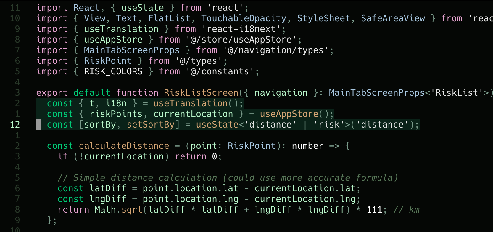

# yoda.nvim



---

### ✨ Features

- Muted green palette for focused, balanced editing
- Minimal UI with clear syntax contrast
- Tree-sitter & LSP semantic highlighting support
- Works with **Lazy.nvim**, **Packer**, and **Plug**

---

### 🚀 Installation

#### **Lazy.nvim**

```lua
{
  "kuri-sun/yoda.nvim",
  priority = 1000,
}
```

#### **Packer**

```lua
use({
  "kuri-sun/yoda.nvim",
  config = function()
    vim.cmd("colorscheme yoda")
  end,
})
```

---

### 🧠 Development

[CONTRIBUTING.md](CONTRIBUTING.md)

---

### 🪪 License

MIT
