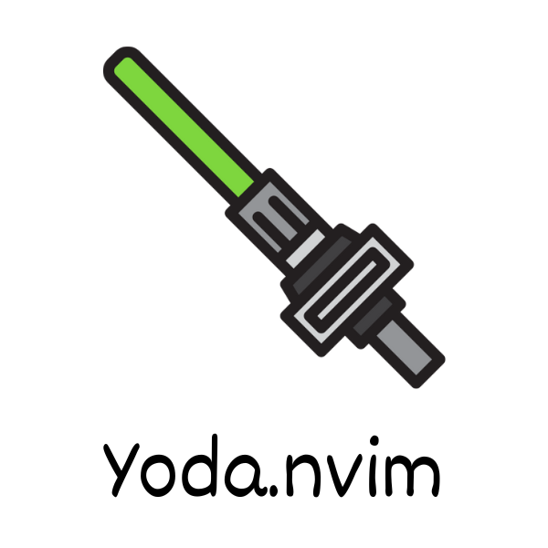
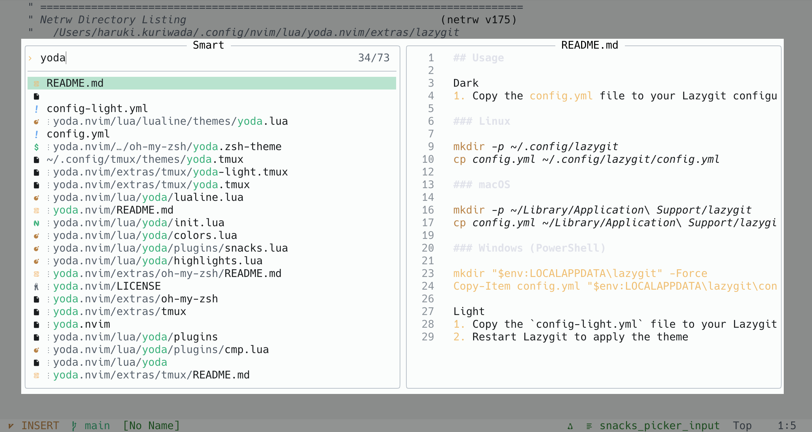

# yoda.nvim

<br/>

<p align="center">
    
</p>

<br/>

<table width="100%">
  <tr>
    <th>Dark</th>
    <th>Light</th>
  </tr>
  <tr>
    <td width="50%">
      
    </td>
    <td width="50%">
      
    </td>
  </tr>
  <tr>
    <td width="50%">
      
    </td>
    <td width="50%">
      
    </td>
  </tr>
</table>

---

### ✨ Features

- Muted green palette for focused, balanced editing
- Dark and light theme variants
- Tree-sitter & LSP semantic highlighting support
- Works with **Lazy.nvim**, **Packer**, and **Plug**

<details>
<summary><b>🔌 Supported Plugins</b></summary>

| Plugin                                                                          | Highlights                                                    |
| ------------------------------------------------------------------------------- | ------------------------------------------------------------- |
| [neo-tree.nvim](https://github.com/nvim-neo-tree/neo-tree.nvim)                 | [neo-tree.lua](lua/yoda/plugins/neo-tree.lua)                 |
| [nvim-tree.lua](https://github.com/nvim-tree/nvim-tree.lua)                     | [nvim-tree.lua](lua/yoda/plugins/nvim-tree.lua)               |
| [telescope.nvim](https://github.com/nvim-telescope/telescope.nvim)              | [telescope.lua](lua/yoda/plugins/telescope.lua)               |
| [nvim-cmp](https://github.com/hrsh7th/nvim-cmp)                                 | [cmp.lua](lua/yoda/plugins/cmp.lua)                           |
| [gitsigns.nvim](https://github.com/lewis6991/gitsigns.nvim)                     | [gitsigns.lua](lua/yoda/plugins/gitsigns.lua)                 |
| [lualine.nvim](https://github.com/nvim-lualine/lualine.nvim)                    | [lualine.lua](lua/lualine/themes/yoda.lua)                    |
| [indent-blankline.nvim](https://github.com/lukas-reineke/indent-blankline.nvim) | [indent-blankline.lua](lua/yoda/plugins/indent-blankline.lua) |
| [snacks.nvim](https://github.com/folke/snacks.nvim)                             | [snacks.lua](lua/yoda/plugins/snacks.lua)                     |
| [dashboard-nvim](https://github.com/nvimdev/dashboard-nvim)                     | [dashboard.lua](lua/yoda/plugins/dashboard.lua)               |
| [which-key.nvim](https://github.com/folke/which-key.nvim)                       | [which-key.lua](lua/yoda/plugins/which-key.lua)               |
| [todo-comments.nvim](https://github.com/folke/todo-comments.nvim)               | [todo-comments.lua](lua/yoda/plugins/todo-comments.lua)       |
| netrw (built-in)                                                                | [netrw.lua](lua/yoda/plugins/netrw.lua)                       |
| [mini.nvim](https://github.com/echasnovski/mini.nvim)                           | [mini.lua](lua/yoda/plugins/mini.lua)                         |
| [noice.nvim](https://github.com/folke/noice.nvim)                               | [noice.lua](lua/yoda/plugins/noice.lua)                       |
| [trouble.nvim](https://github.com/folke/trouble.nvim)                           | [trouble.lua](lua/yoda/plugins/trouble.lua)                   |

</details>

---

### 🚀 Installation

#### **Lazy.nvim**

```lua
{
  "kuri-sun/yoda.nvim",
}
```

#### **Packer**

```lua
use { "kuri-sun/yoda.nvim" }

```

---

### 🚀 Usage

```lua
vim.cmd("colorscheme yoda")
```

---

### ⚙️ Configuration

```lua
require("yoda").setup({
    -- Set light or dark variant
    theme = "dark", -- "dark" or "light"

    -- Style options
    italic_comments = true,
    transparent_background = false,
    bold_keywords = true,
    underline_match_paren = true,

    -- Override specific colors
    colors = {}, -- Override palette colors

    -- Override specific highlight groups
    highlights = {}, -- Override highlight groups

    -- Disable or enable colorscheme extensions
    extensions = {
        telescope = true,
        neo_tree = true,
        nvim_tree = true,
        cmp = true,
        gitsigns = true,
        snacks = true,
        netrw = true,
        todo_comments = true,
        indent_blankline = true,
        dashboard = true,
        which_key = true,
        misc = true,
        mini = true,
        noice = true,
        trouble = true,
    },
})
```

#### **Lualine Setup**

To use the yoda theme with lualine:

```lua
require('lualine').setup {
  options = {
    theme = 'yoda',
    -- ... other lualine options
  }
}
```

---

### 🎁 Extras

- **[Lazygit](extras/lazygit/)**
- **[Alacritty](extras/alacritty/)**
- **[Tmux](extras/tmux/)**
- **[Oh My Zsh](extras/oh-my-zsh/)**
